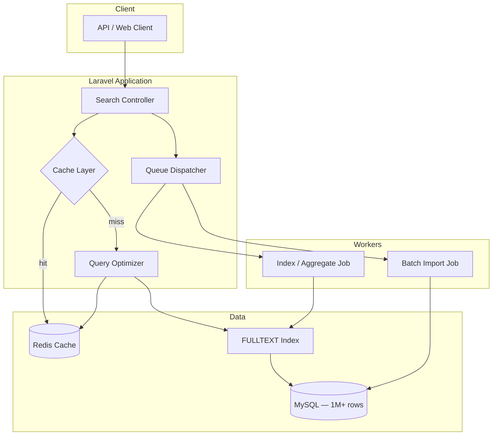
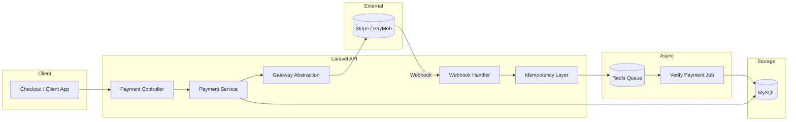
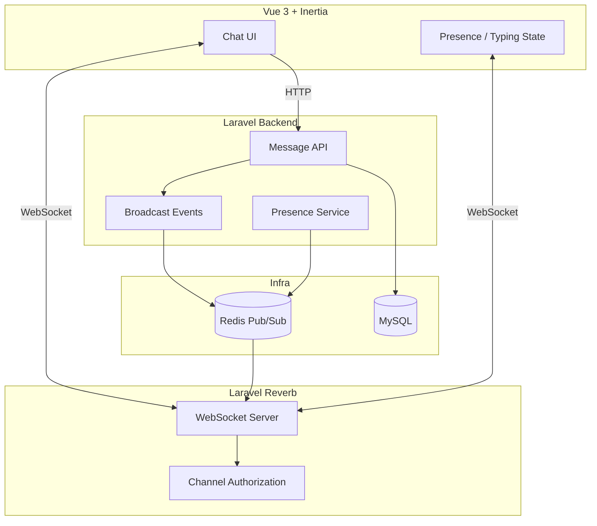

<!--
**DevEsraaMahmoud/DevEsraaMahmoud** is a ✨ special ✨ repository because its README.md appears on your GitHub profile.
-->

# Hi, I'm Esraa 👋

Senior Full-Stack Engineer with a strong backend and product mindset.  
I build scalable, production-ready systems with **Laravel** and modern web stacks.

## 🔧 Tech Focus

  
  
  
  
  
  
  
  
  
  
  
  
  
  
  
  
  

## ⚙ Engineering Interests

  
  
  
  
  
  
  
  

---

## Metrics

---

## 🔥 Contribution Streak

  

---

## 🚀 Featured Projects

---

### 🔹 Laravel Million Users

High-performance system for 1M+ records with optimized search and batch processing.

#### 🧱 Architecture

#### ⚡ Highlights
- MySQL FULLTEXT search at scale
- Redis caching for hot queries
- Queue-based batch imports & indexing
- EXPLAIN-driven query optimization

🔗 https://github.com/DevEsraaMahmoud/laravel-million-users

---

### 🔹 Payment Integration Demo

Production-style payment processing with secure webhooks, idempotent flows, and async verification.

#### 🧱 Architecture

#### ⚡ Highlights
- Idempotent payment processing
- Secure webhook validation
- Retry-safe queue-based verification
- Transaction logging & failure recovery

🔗 https://github.com/DevEsraaMahmoud/payment-integration-demo

---

### 🔹 PingMe — Real-Time Communication

Real-time messaging with presence, typing indicators, and event broadcasting.

#### 🧱 Architecture

#### ⚡ Highlights
- WebSocket real-time messaging
- Presence & typing indicators
- Redis pub/sub for horizontal scaling
- Event-driven broadcast pipeline

🔗 https://github.com/DevEsraaMahmoud/PingMe

---

## 🧠 How I Think

- Start from the **problem**, not the framework
- Prefer **simple architectures** that can evolve
- Measure before optimizing
- Care about trade-offs and real business impact

---

## 📫 Get in Touch

- LinkedIn: https://linkedin.com/in/esraa-mahmoud
